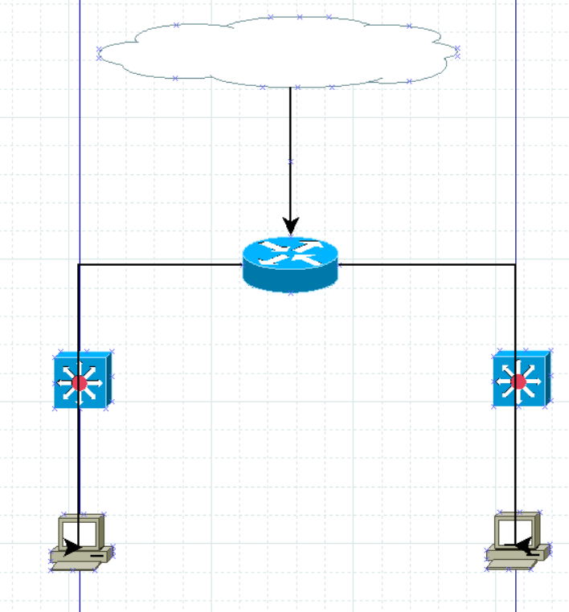

Zadanie 1
---------

1. Zaprojektuj oraz przygotuj prototyp rozwiązania z wykorzystaniem oprogramowania ``VirtualBox`` lub podobnego. 
Zaproponuj rozwiązanie spełniające poniższe wymagania:
   * Usługodawca zapewnia domunikację z siecią internet poprzez interfejs ``eth0`` ``PC0``
   * Zapewnij komunikację z siecią internet na poziomie ``LAN1`` oraz ``LAN2``
   * Dokonaj takiego podziału sieci o adresie ``172.22.128.0/17`` aby w ``LAN1`` można było zaadresować ``500`` adresów natomiast w LAN2 ``5000`` adresów    
   * Przygotuj dokumentację powyższej architektury w formie graficznej w programie ``DIA``
   
   **Rozwiązanie**
   -----------------
   
   1. Podział adresu 172.22.128.0/17 na 2 podsieci o adresach LAN1(172.22.128.0/19) i   LAN2(172.22.160.0/23) bo 2^(32-19)-2=8190 i 2^(32-23)-2=510
   2. Tworzymy 3 sieci NAT, LAN1, LAN2 i trzy VM PC0, PC1, PC2
   3. PC0 słuzy jako router :
       * NAT enp0s3
       * ip a add 172.22.128.1/19 dev enp0s8
       * ip a add 172.22.160.1/23 dev enp0s9
       * ip link set enp0s8 up
       * ip link set enp0s9 up
       * echo 1 > /proc/sys/net/ipv4//ip_forward
       * iptables -t nat -A POSTROUTING -s 172.22.128.0/19 -o enp0s3 -j MASQUERADE
       * iptables -t nat -A POSTROUTING -s 172.22.160.0/23 -o enp0s3 -j MASQUERADE
           
          
   4. PC1:
       * ip a add 172.22.128.1/19 dev enp0s3
       * ip link set enp0s3 up
       * ip route add default via 172.22.128.1
       
   5. PC2:
       * ip a add 172.22.160.1/23 dev enp0s3
       * ip link set enp0s3 up
       * ip route add default via 172.22.160.1
       
       **Diagram**
       --------------
       
        
       
       
       
       
       
     
       
       
       
 
